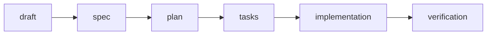

<!--
**indhio/indhio** is a ✨ _special_ ✨ repository because its `README.md` (this file) appears on your GitHub profile.

### Hi there 👋

Here are some ideas to get you started:

- 🔭 I’m currently working on ...
- 🌱 I’m currently learning ...
- 👯 I’m looking to collaborate on ...
- 🤔 I’m looking for help with ...
- 💬 Ask me about ...
- 📫 How to reach me: ...
- 😄 Pronouns: ...
- ⚡ Fun fact: ...
-->

# Vinicius Nascimento :man_technologist:

## 🎯 What I do

25+ years shipping software across enterprise, startup, and international environments. My current focus is AI integration — specifically the engineering work that makes LLMs reliable and useful inside real, complex systems.

 - 🤖  AI Solutions Architect
 - 💻  Software Engineer
 - ⌨️  Full Stack Developer
 - 🚀  Entrepreneur
 - 🛠️  Solution Architect
 - ⚙️  Integration Specialist
 - 🎸  Musician
 - ♟️  Chess Player
 - 🥋  Brown Belt Jiu-jitsu
 
## 🚀 Business and Entrepreneurship

 - IT Consulting
 - Senior Software Engineer @ [Carnegie Learning](https://www.carnegielearning.com/) (US)  
 - CTO & Partner @ [Trend Soluções](https://trend.com.br) — multi-channel CRM, 20+ microservices in production  
 - CTO, Co-Founder and Partner @ [Smartline](https://smartline.com.br)
 - Founder @ [Indh.io Technologies](https://indh.io)  

<!-- ## Skills, Stacks, Technologies
 - 🤖  Context Engineering, Agentic AI, LLM Integration, AI Systems Architecture
 - ☁️  AWS Kinesis, Firehose, Lambda, S3 · Snowflake ETL Pipelines
 - ⚙️  Java, Spring Boot, JEE, JPA, EJB, Hibernate
 - 🟦  TypeScript, JavaScript, Node.js, NestJS
 - 🖥️  Angular, React, React Native
 - 🗄️  MongoDB, GraphQL, MySQL, Neo4j
 - 📨  RabbitMQ, Kafka, Redis
 - 🐳  Docker, Kubernetes, Containers
 - 🔐  SSO, OAuth2, Identity & Auth Platforms
 - 🌐  Firebase, AWS, Google Cloud, Oracle Cloud -->

## 🧰 Skills, Stacks, Technologies

**AI Engineering**

**Backend**

**Frontend**

**Data & Messaging**

**Cloud & Infra**

 ## ⚙️ How I ship with AI

**Spec-Driven Development**, with **Context Engineering as the base layer** — not a step in the sequence, the foundation under all of them.

- **Draft before spec** — free-form exploration of the business, UX and constraints, so the context is already built when the spec is generated
- **Human approval between every stage** — no stage runs on top of an unreviewed one
- **Verification in a fresh session** — the implementation is checked against the spec, not against the merge

## ✍️ Writing

I write about Spec-Driven Development and Context Engineering in practice — real workflows on real codebases, not hype.

→ [Articles on LinkedIn](https://www.linkedin.com/in/viniciusnitt/)

## Teaching machines to survive the real world

Copyright © [Indh.io Technologies](https://indh.io/)

